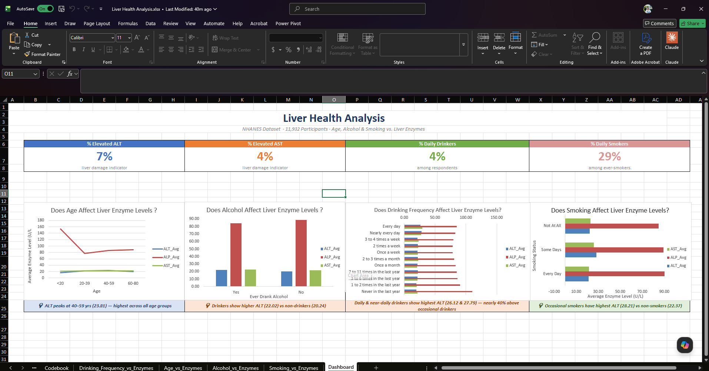
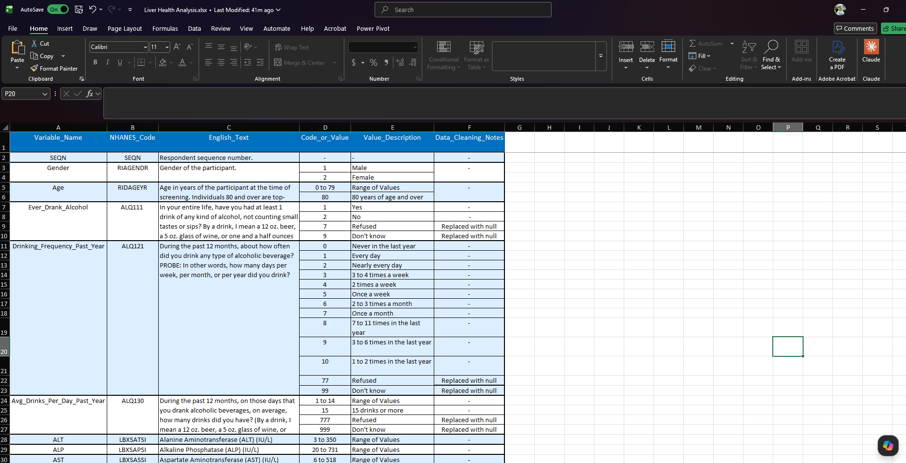
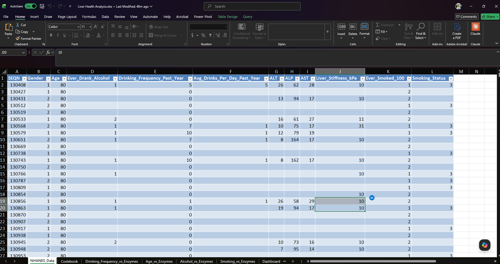

# Liver Health Analysis — NHANES 2021-2023

An Excel-based analysis exploring how age, alcohol consumption, and smoking relate to liver enzyme levels (ALT, ALP, AST) using real-world health data from the CDC's National Health and Nutrition Examination Survey.

---

## Dashboard

---

## Project Question

Does lifestyle — specifically drinking and smoking — actually affect your liver? And if so, how much?

---

## Data Source

**Dataset:** NHANES August 2021–August 2023  
**Source:** [CDC / National Center for Health Statistics](https://wwwn.cdc.gov/nchs/nhanes/)  
**Files used:** ALQ_L.xlsx, BIOPRO_L.xlsx, DEMO_L.xlsx, LUX_L.xlsx, SMQ_L.xlsx  
**Total participants:** 11,932

---

## Data Preparation

All five files were loaded into Excel via **Power Query → Get Data → From Folder**, then merged into a single query using **Left Outer Joins on SEQN** (the CDC's unique participant identifier).

From the merged dataset of 127 columns, 12 were selected:

| Column Name | NHANES Code | Description |
|---|---|---|
| SEQN | SEQN | Unique participant ID |
| Gender | RIAGENDR | 1 = Male, 2 = Female |
| Age | RIDAGEYR | Age in years (80+ coded as 80) |
| EverDrankAlcohol | ALQ111 | Ever had a drink in life? 1=Yes, 2=No |
| DrinkingFrequency_PastYear | ALQ121 | How often drank in past 12 months |
| AvgDrinks_PerDay_PastYear | ALQ130 | Average drinks per occasion |
| ALT | LBXSATSI | Alanine Aminotransferase (U/L) |
| ALP | LBXSAPSI | Alkaline Phosphatase (U/L) |
| AST | LBXSASSI | Aspartate Aminotransferase (U/L) |
| LiverStiffness_kPa | LUANMVGP | Liver stiffness in kPa |
| EverSmoked100 | SMQ020 | Smoked 100+ cigarettes in life? |
| SmokingStatus | SMQ040 | Current smoking status |

**Cleaning steps applied:**
- Erroneous scientific notation values (5.39761E-79) replaced with null
- Refused (7, 77, 777) and Don't Know (9, 99, 999) responses replaced with null
- Final table: 11,932 rows × 12 columns

---

## Codebook Sheet

A custom codebook was built to document each variable — including the original NHANES question text, all coded values, and data cleaning notes.

---

## Data Sheet

---

## Analysis & Pivot Tables

Four pivot tables were created, each showing average ALT, ALP, and AST:

**1. Age vs Liver Enzymes**  
Grouped participants into age ranges (<20, 20–39, 40–59, 60–80). ALT peaks in the 40–59 group (23.81 U/L). ALP is notably higher under age 20 — this reflects normal bone growth, not liver pathology.

**2. Alcohol Consumption vs Liver Enzymes**  
Compared ever-drinkers vs non-drinkers. Drinkers show higher average ALT (22.02) vs non-drinkers (20.24).

**3. Smoking Status vs Liver Enzymes**  
Compared daily smokers, occasional smokers, and former smokers. Occasional smokers show the highest ALT (28.21) vs non-smokers (22.37).

**4. Drinking Frequency vs Liver Enzymes**  
Daily and near-daily drinkers show the highest ALT values (26.12 and 27.79) — nearly 40% above occasional drinkers.

---

## Key Findings

- ALT peaks in middle-aged adults (40–59), suggesting cumulative liver stress over time
- Daily and near-daily drinkers have the highest ALT — but the difference is more modest than expected
- Occasional smokers show higher enzyme levels than daily smokers, which may reflect sample size variability
- ALP is markedly higher in participants under 20 — normal bone growth, not liver pathology
- Overall, no single lifestyle factor dominates — liver health appears to be multifactorial

---

## Tools Used

- Microsoft Excel (Power Query, Pivot Tables, Pivot Charts, Dashboard)
- Git & GitHub

---

## Dataset Reference

Centers for Disease Control and Prevention. *National Health and Nutrition Examination Survey, August 2021–August 2023.* U.S. Department of Health and Human Services. https://www.cdc.gov/nchs/nhanes/